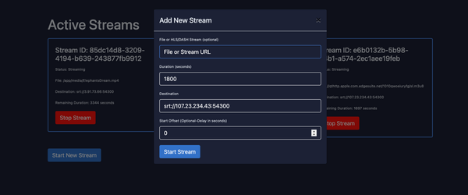

# **Testing Tool - Stream Manager**
Stream Manager is a simple tool to create SRT Streams for demonstration purposes.
The tool can either randomly select a file from a predefined list or accept downloadable files via HTTP/HTTPS. Additionally, it supports HLS and DASH streams as input formats. Stream Manager can be accessed through a REST API (see documentation below) or via the User Interface.
# **User Interface**

Once logged in, there is an Overview of the currently active Streams :

 

Possible States for active Streams are Streaming, Scheduled (if delay is added) and Downloading.

When clicking on “Stop Stream”, the Stream is immediately stopped, there is no confirmation prompt.

Scheduled Streams can not be stopped.

Downloading Streams can not be stopped.

The Total amount of concurrent Streams (over all States) is 10 currently. This can be changed, if needed.

 

When creating a new Stream, the following Data** is Mandatory:
Destination:

SRT Endpoint (as Listener) in the Format: srt://ip:port (e.g. srt://1.1.1.1:1111). Endpoints in Caller Mode are not supported.

Duration:

The Duration for which the Stream should be active, in Seconds. Downloaded Files, Random Files and VOD HLS/DASH Streams will be looped if the Duration > Stream/File Duration.

Without providing a specific URL in the field “File or Stream URL”, a random File is selected from a list of files. Those files are tested for compliance with the Live Preview and Metadata Feature in Live Capture as a Service.

When providing a specific File or Stream via URL, there is a Risk that either of the above Feastures might not work correctly or at all. It is recommended to Test random Files prior to an Demo.

Optional Data:

File or Stream URL: URL if a custom HLS/DASH or File is to be used. The URL has to be in the Format of

- http(s)://example.com/example.mp4
- http(s)://example.com/example.m3u8
- http(s)://example.com/example.mpd

Start Offset:

If the Stream should not start immediately, an offset can be configured, in seconds. Streams with an offset will start in the scheduled state, indicating their start time in the stream card. When the start time is reached, the streams will start automatically for the duration specified.
# **API Documentation**
### **Base URL**
- The API is served at the base URL: http://srtstreamer.cloud.ts-stage.net/
-----
## **Authentication**
- **API Key Authentication**: Each user must include a valid x-api-key header in requests to authenticate.
-----
## **Endpoints**
-----
### **1. Health Check**
#### **GET /healthcheck**
- **Description**: Check if the API service is running.
- **Authentication**: None
- **Response**:
  - **200 OK**: {"status": "healthy"}
-----
### **2. Login**
#### **POST /login**
- **Description**: Authenticate with username and password to retrieve an API key.
- **Authentication**: Basic Authentication (username and password)
- **Request Headers**:
  - Authorization: Basic <encoded-credentials>
- **Response**:
  - **200 OK**: Returns a JSON object with the API key and its expiration timestamp.
    - Example:
    - {

      `  `"message": "Login successful",

      `  `"expiration": <timestamp>,

      `  `"api\_key": "<api\_key>"

      }

  - **401 Unauthorized**: Invalid credentials.
-----
### **3. Start a Stream**
#### **POST /start-stream**
- **Description**: Initiates a new stream, either immediately or after a specified delay.
- **Authentication**: API Key (Header)
- **Request Headers**:
  - x-api-key: <api\_key>
- **Request Body**:
  - input\_type (string, required): Type of input, either "file" or "url".
  - file (string, optional): Path to the file or URL to stream. If file is not provided, a random file from the media directory will be selected.
  - duration (integer, required): Duration in seconds for the stream.
  - destination (string, required): Streaming destination URL.
  - start\_offset (integer, optional): Delay before starting the stream in seconds (default: 0).
- **Response**:
  - **200 OK**: Returns stream details and status.
    - Example:
    - {

      `  `"status": "success",

      `  `"stream\_id": "<stream\_id>",

      `  `"destination": "<destination>",

      `  `"scheduled\_start\_time": "<timestamp\_if\_scheduled>",

      `  `"message": "Stream is starting immediately" or "Stream has been scheduled"

      }

  - **429 Too Many Requests**: Maximum number of concurrent streams reached.
  - **400 Bad Request**: Invalid or missing parameters.
-----
### **4. Stop a Stream**
#### **POST /stop-stream/{stream\_id}**
- **Description**: Stops an active stream by its ID.
- **Authentication**: API Key (Header)
- **Request Headers**:
  - x-api-key: <api\_key>
- **Path Parameters**:
  - stream\_id (string, required): ID of the stream to stop.
- **Response**:
  - **200 OK**: Confirms that the stream has been stopped.
    - Example:
    - {

      `  `"status": "stopped",

      `  `"stream\_id": "<stream\_id>"

      }

  - **404 Not Found**: Stream with the specified ID does not exist.
-----
### **5. Stream Status**
#### **GET /stream-status/{stream\_id}**
- **Description**: Retrieves the current status of a specific stream by its ID.
- **Authentication**: API Key (Header)
- **Request Headers**:
  - x-api-key: <api\_key>
- **Path Parameters**:
  - stream\_id (string, required): ID of the stream to check.
- **Response**:
  - **200 OK**: JSON object with stream status and details.
    - Example:
    - {

      `  `"stream\_id": "<stream\_id>",

      `  `"status": {

      `    `"status": "Streaming",

      `    `"remaining\_duration": <remaining\_time\_in\_seconds>,

      `    `"file": "<file\_name>",

      `    `"destination": "<destination\_url>",

      `    `"scheduled\_start\_time": "<timestamp\_if\_scheduled>"

      `  `}

      }

  - **404 Not Found**: Stream with the specified ID does not exist.
-----
### **6. List Active Streams**
#### **GET /active-streams**
- **Description**: Lists all active, scheduled, and downloading streams.
- **Authentication**: API Key (Header)
- **Request Headers**:
  - x-api-key: <api\_key>
- **Response**:
  - **200 OK**: JSON object with details of all active streams.
    - Example:

      {

      `  `"active\_streams": [

      `    `{

      `      `"stream\_id": "<stream\_id>",

      `      `"status": {

      `        `"status": "Streaming",

      `        `"remaining\_duration": <remaining\_time\_in\_seconds>,

      `        `"file": "<file\_name>",

      `        `"destination": "<destination\_url>",

      `        `"scheduled\_start\_time": "<timestamp\_if\_scheduled>"

      `      `}

      `    `},

      `    `{

      `      `"stream\_id": "<stream\_id>",

      `      `"status": {

      `        `"status": "Downloading",

      `        `"remaining\_duration": 0,

      `        `"file": "<file\_name>",

      `        `"destination": "<destination\_url>",

      `        `"scheduled\_start\_time": "<timestamp\_if\_scheduled>"

      `      `}

      `    `}

      `  `]

      }

-----
### **Example Usage of the /start-stream Request**
**Request Body**:

curl -X POST http://srtstreamer.cloud.ts-stage.net/start-stream \

-H "Content-Type: application/json" \

-H "X-API-Key: dJ-ZW4UYdKLofOHIw8Val2EgRKNHbn09VUVDq2CvbTg" \

-d '{

`  `"input\_type": "file",

`  `"file": "http://example.com/sample-video.mp4",

`  `"duration": 120,

`  `"destination": "srt://1.1.1.1:1111",

`  `"start\_offset": 10

}'

**Response**:

{

`  `"status": "success",

`  `"stream\_id": "1234abcd-5678-efgh-9012-ijklmnopqrst",

`  `"destination": "srt://1.1.1.1:1111",

`  `"scheduled\_start\_time": "2024-11-01T12:30:45Z",

`  `"message": "Stream has been scheduled"

}
